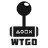

#  **WTGD Framework**

 A **SFML-ready framework** that supports the addition of **gameobjects** with **attachable components**.

<br>

# **Contents**
[**Installation**](#installation) - [**Supported Functionalities**](#basic-functionalities) - [**Get Started**](#get-started)  - [**Official Documentation**](https://wtgd-framework.000webhostapp.com/)

<br>

## **Installation**
> Run `installation.bat` present in the release folder, it will automatically generate a SFML ready-to-go project and link all the necessary files in order to get you started.
<br>
>You will have to **type** your desired **Visual Studio version** in order to generate the demo solution **(as of for now only 2019 and 2022 are supported)**
<br>
>Once the solution is **generated**, the `installation.bat` will **copy** all the necessary `.dll` files into the output folder in order to let the program compile.
<br>
>You may now open the solution and **get started.**

<br>

## **Supported Functionalities**
As of for now the WTGD Framework supports:
`GameObjects`, `Components`, `Movement`, `Keyboard Controller`, `Joystick Controller`, `Simple Collision Detection`, `Transform`, `Utility Static Struct`.
<br>
The framework also provides simple ready-to-play classes such as: `Character` and `WorldObject`.
<br>
All classes are extendable, providing room for improvement and creativity.

<br>

## **Get Started**
<br>

Before starting **make sure you followed** all the necessary steps in [**Installation**](#installation).
<br>
<br>
In this **example** i will guide you on how to create a **simple loop** and add a movable `character` in it.
<br>
Once you open the **generated** solution you will be met with a **blank project**, simply create the `main.cpp`.
<br>
For the sake of **semplicity** i will illustrate how to get started on the `main.cpp` file, **ideally** you should create a **dedicated class** in order to store and initialize the **gameobjects**.
<br>
You will have to create the `WTGD::LoopManager` class by **adding** the include in order to get started.

```cpp
#include <WTGD/loop-manager/LoopManager.h>
```
You will now have to create a new pointer to the class
```cpp
WTGD::LoopManager* manager = new WTGD::LoopManager();
```
Now, to create a `character`, simply do like so
``` cpp
WTGD::Character* player = new WTGD::Character(new WTGD::KeyboardController(), "Player");
```
This will create a movable `character` with a `WTGD::KeyboardController()` as input, in alternative you may pass `WTGD::JoystickController()`, the second parameter simply refers to the `gameobject` name.
<br>
A `character`, as other objects, contains functions that allow it to be **personalized**:
``` cpp
player->renderer->set_texture("res\\pacman.png"); //res path is relative to project path in editor
player->transform->set_scale(100, 100);
player->transform->set_position(640, 360);
player->set_tag("Player");
```
Now, create a `std::vector<Gameobjects*> gameobjects` to store your newly created player with `gameobjects.push_back(player)`.

In order to make collision work you will have to call
```cpp
manager->add_colliders(gameobjects);
```
You are now done with the gameobject creation, at last, you now have to **create the game window and run the loop**
```cpp
manager->createWindow(1280, 720, "My Awesome Game!");
manager->run(gameobjects);
```
You should see a white square in the screen, move around with `WASD` and rotate using `Left and Right`.

---

<br>

### **For a better understanding of the framework refer to the [official documentation](https://wtgd-framework.000webhostapp.com/)**
#### [**Distributed under MIT License**](https://en.wikipedia.org/wiki/MIT_License)
##### Developed by Kevin Salimbeni